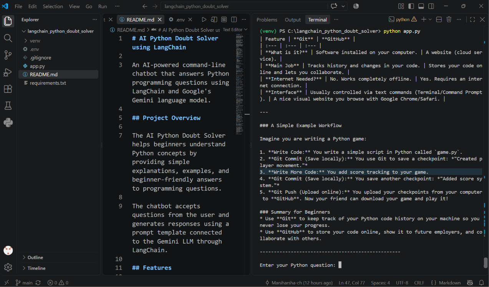

# AI Python Doubt Solver using LangChain

An AI-powered command-line chatbot that answers Python programming questions using LangChain and Google's Gemini language model.

## Demo

## Project Overview

The AI Python Doubt Solver helps beginners understand Python concepts by providing simple explanations, examples, and beginner-friendly answers to programming questions.

The chatbot accepts questions from the user and generates responses using a prompt template connected to the Gemini LLM through LangChain.

## Features

- Answers Python programming questions
- Uses Google's Gemini AI model
- Built using LangChain
- Uses a structured prompt template
- Supports multiple questions in one session
- Beginner-friendly explanations
- Handles empty user input
- Includes basic error handling
- Allows the user to exit using `exit`
- Stores API keys securely using `.env`

## Technologies Used

- Python
- LangChain
- Google Gemini
- langchain-google-genai
- python-dotenv
- VS Code

## Project Structure

langchain_python_doubt_solver/
│
├── app.py
├── requirements.txt
├── .env
├── .gitignore
└── README.md

## Installation and Setup

### 1. Clone the repository

git clone https://github.com/Maniharsha-ch/langchain-python-doubt-solver.git

### 2. Open the project folder

cd langchain-python-doubt-solver

### 3. Create a virtual environment

python -m venv venv

### 4. Activate the virtual environment

For Windows PowerShell:

venv\Scripts\Activate.ps1

### 5. Install required libraries

pip install -r requirements.txt

### 6. Create a `.env` file

Add your Gemini API key in the following format:

GOOGLE_API_KEY=api_key_here

Never share or upload your API key publicly.

## How to Run

Run the following command:
python app.py

Then enter a Python question.
Example:
Enter your Python question: What is a tuple in Python?

To stop the chatbot:
exit

## Example Questions

- What is a list in Python?
- What is the difference between a list and a tuple?
- Explain Python functions with an example.
- What is a dictionary in Python?
- What is the difference between `==` and `is`?

## How It Works

User enters Python question
          ↓
PromptTemplate formats the question
          ↓
LangChain sends prompt to Gemini
          ↓
Gemini generates the answer
          ↓
Answer is displayed in the terminal

## Learning Outcomes

Through this project, I learned:

- How to connect an LLM with LangChain
- How to use `ChatGoogleGenerativeAI`
- How to create and use `PromptTemplate`
- How to securely load API keys using environment variables
- How to invoke an LLM using LangChain
- How to build a basic AI chatbot
- How to handle user input and errors in Python

## Security Note

The `.env` file is excluded using `.gitignore` to prevent accidentally exposing the Gemini API key.

## Future Improvements

- Add a graphical user interface using Streamlit
- Add chat history
- Add topic-based Python learning modes
- Add code execution support
- Add quiz and practice-question generation
- Deploy the chatbot as a web application

## Author

ManiHarsha Chetlapelly